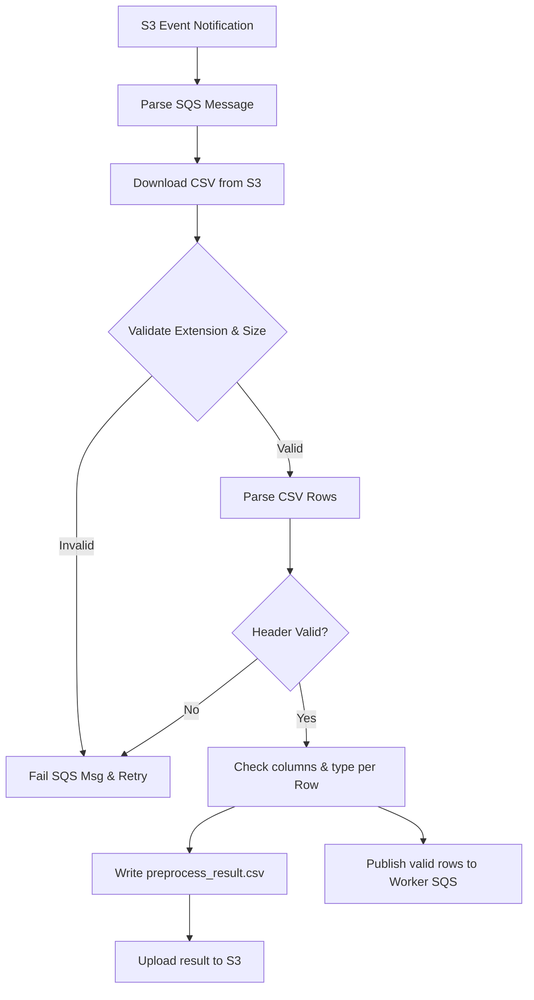

# Project Phases Design: Card Onboarding Platform 2026

This document maps out the structured development phases for building the **Card Onboarding Platform**. It is divided into 8 implementation phases, each containing clear objectives, target files, technical specifications, and verification criteria.

---

## 🗺️ Phase Overview

| Phase | Title | Focus Area | Complexity |
|:---|:---|:---|:---|
| **Phase 1** | Foundation & API Contracts | Repository scaffolding & OpenAPI specs generation | Low |
| **Phase 2** | Downstream Core Mocks | Implementing customer & account management stubs | Low |
| **Phase 3** | Core Orchestrator (onboard-service) | State machine, resume logic, and DynamoDB stores | High |
| **Phase 4** | S3 File Preprocessor Worker | S3 events, CSV structure validator, and fan-out | Medium |
| **Phase 5** | Card Onboarding Processor Worker | Business validation, consumer loop, retry rules | Medium |
| **Phase 6** | Infrastructure as Code (IaC) | AWS CDK v2 stacks configuration in Go | Medium |
| **Phase 7** | Quality Assurance & CI/CD | Unit tests, smoke tests, and Buildkite pipelines | High |
| **Phase 8** | Observability & Operations | Datadog dashboards, structured logging, alarms | Medium |

---

## 🛠️ Phase-by-Phase Design

---

### Phase 1: Foundation & API Contracts
**Goal:** Initialize repositories, define OpenAPI 3.0 specifications, and automate Go client/server stub generation.

#### 📁 Key Files
- [card-onboarding-services/go.mod]
- [card-onboarding-services/Makefile]
- [onboard-service/swagger-internal.yaml]
- [customer-management-service/swagger-internal.yaml]
- [account-management-service/swagger-internal.yaml]
#### 📝 Technical Execution
1. **Scaffold Services & Workers Repositories:** Run `go mod init` for both projects.
2. **Draft OpenAPI specs:** Write request/response contracts for `/internal` paths. Define standard error payloads:
   ```json
   {
     "code": "string",
     "message": "string",
     "correlationId": "string",
     "details": [{"field": "string", "issue": "string"}]
   }
   ```
3. **Configure code-gen (`oapi-codegen.yaml`):** Set up rules for generating Gin server wrappers, typed structs, and HTTP client SDKs for each service.
4. **Make automation:** Write `generate`, `swagger-validate`, and `generate-check` scripts.

#### 🔬 Verification Gate
- `make swagger-validate` runs successfully on all contracts.
- Code generation compiles cleanly without errors.

---

### Phase 2: Downstream Core Mocks
**Goal:** Implement simulated banking services (`customer` and `account`) with triggerable failures to facilitate smoke testing.

#### 📁 Key Files
- [customer-management-service/main.go]
- [customer-management-service/internal/customer/handler.go]
- [account-management-service/main.go]
- [account-management-service/internal/account/handler.go]

#### 📝 Technical Execution
1. **Customer Service Stub:** Bind Gin routes to mock functions. 
   - Inspect request `customerId`: return `HTTP 500` for `"CUST_FAIL_REGISTER"`, `HTTP 400` for `"CUST_BAD_REQUEST"`.
2. **Account Service Stub:**
   - Inspect request `customerId`: return `HTTP 500` for `"CUST_FAIL_INTEREST"`, `HTTP 404` for `"CUST_NO_INTEREST"`.
3. **Logging:** Add correlation tracking to all incoming request logs.

#### 🔬 Verification Gate
- Unit tests verify mock failure scenarios with specific customer IDs.
- Local Gin server endpoints run and return correct simulated payloads.

---

### Phase 3: Core Orchestrator (onboard-service)
**Goal:** Develop the onboarding state-machine, resume logic, and DynamoDB data store layers.

#### 📁 Key Files
- [onboard-service/internal/store/request_status_store.go]
- [onboard-service/internal/store/account_details_store.go]
- [onboard-service/internal/orchestration/service.go]
- [onboard-service/internal/client/customer_client.go]

#### 📝 Technical Execution
1. **DynamoDB Stores:** Write repository code for `onboard-service-request-status` (tracking workflow step states) and `onboard-service-account-details` (storing client account maps).
2. **HTTP Wrappers:** Wrap the generated OpenAPI clients. Configure automatic circuit breakers/timeouts, inject `correlationId` headers, and map downstream errors to standard code exceptions.
3. **Orchestration & Resume Rules:**
   - On request: check existing status in DynamoDB.
   - **Step 1:** If customer registration status is missing/`FAILED`, execute registration request.
   - **Step 2:** If registration is `SUCCEEDED` but interest rate fetching is missing/`FAILED`, proceed to interest rate call.
   - **Step 3:** Save account credentials to storage and update `overallStatus` to `SUCCEEDED`.
   - **Step 4 (Idempotency):** If `overallStatus` is already `SUCCEEDED`, fetch details from store and return immediately without querying downstream APIs.

> [!IMPORTANT]
> **Phased Updates Rule:** Do not initialize all steps as `NOT_STARTED` or save blank states. Write to status attributes *only* as they are processed.

#### 🔬 Verification Gate
- Test code verifies that step-by-step state recovery functions exactly as expected when simulating downstream failures.
- Store unit tests run against local DynamoDB container (or mocks).

---

### Phase 4: S3 File Preprocessor Worker
**Goal:** Build the CSV preprocessor worker to validate file metadata/structure and split accepted rows to SQS.



#### 📁 Key Files
- [card-onboarding-file-preprocessor/main.go]
- [card-onboarding-file-preprocessor/internal/parser/csv_structure_validator.go]
- [card-onboarding-file-preprocessor/internal/s3/client.go]

#### 📝 Technical Execution
1. **SQS Event Trigger:** Lambda reads event source data from SQS queue `card-onboarding-file-preprocessor-sqs-{env}`.
2. **Metadata Validations:** Validate extension is `.csv`, file size is $>0$ and within max limits.
3. **Structure Checks:** Check that headers match `customer_id,card_type,card_number,expiry_date,holder_name,email` exactly and columns count is exactly 6.
4. **Publishing Output:** Save a summary CSV (`_preprocess_result.csv`) on output bucket detailing `ACCEPTED` and `REJECTED` rows. Publish accepted records to worker SQS queue.

#### 🔬 Verification Gate
- Unit tests verify structure checks pass/fail with invalid files.
- S3 client mocks confirm upload of preprocessing results.

---

### Phase 5: Card Onboarding Processor Worker
**Goal:** Implement the worker queue consumer to process single record payloads, perform business checks, and trigger onboarding.

#### 📁 Key Files
- [card-onboarding-worker/main.go]
- [card-onboarding-worker/internal/validator/business_validator.go]
- [card-onboarding-worker/internal/client/onboard_client.go]

#### 📝 Technical Execution
1. **Event Consumer:** Consume individual JSON record events.
2. **Business Validation Rules:**
   - Valid formats: `cardType` $\in$ `{VISA, MASTERCARD, AMEX}`; `cardNumber` must be numeric; `expiryDate` format must match `MM/YY`; `email` must match syntax regex.
3. **Response Routing & Retry Rules:**
   - **Business failure:** Return success (deletes SQS message, no DLQ, no retry).
   - **Onboard Service 2xx / 4xx:** Return success.
   - **Onboard Service 5xx / Timeout:** Return error (SQS retries, moves to DLQ after 3 failures).
4. **PII Protection:** Mask card numbers in logs (`************1234`).

#### 🔬 Verification Gate
- Unit tests cover validation logic, masking filters, and mapping of 2xx/4xx/5xx status returns.

---

### Phase 6: Infrastructure as Code (IaC)
**Goal:** Provision AWS resources safely using AWS CDK v2 in Go.

#### 📁 Key Files
- [card-onboarding-file-preprocessor/internal/infra/stack/preprocessor_stack.go]
- [card-onboarding-worker/internal/infra/stack/worker_stack.go]
- [card-onboarding-workers/Makefile]

#### 📝 Technical Execution
1. **Configure CDK Stack:** Create constructs in Go utilizing CDK packages (`awslambda`, `awssqs`, `awss3`, `awsiam`).
2. **Queues Setup:** Deploy SQS queues with `visibilityTimeout: 60s`, `messageRetentionPeriod: 4 days`, and dead-letter queues (DLQ) with `maxReceiveCount: 3`.
3. **Security Profiles:** Grant minimal IAM roles to Lambdas (e.g. read/write permissions for specific S3 path nodes and SQS queues).

#### 🔬 Verification Gate
- `cdk synth` finishes with no compile errors and outputs valid CloudFormation templates.

---

### Phase 7: Quality Assurance & CI/CD
**Goal:** Establish build gating pipelines in Buildkite, achieve $>70\%$ code coverage, and construct automated smoke integration tests.

#### 📁 Key Files
- [card-onboarding-services/pipeline.yaml]
- [card-onboarding-workers/pipeline.yaml]
- [card-onboarding-workers/smoke-test/smoke_test.go]

#### 📝 Technical Execution
1. **Pipeline Execution Rules:** Compile/Test steps for linting, Swagger validation, unit tests, code-gen status check, and Docker builds.
2. **Integration Smoke Tests:** Write tests executing the following flow:
   - File upload -> verify preprocessing result generation -> worker trigger -> orchestrator HTTP mock endpoints check -> database values updated.
   - Assert failure scenarios: invalid file structure, incorrect business fields, downstream failure resumes, and message transfer to DLQ after 3 retries.

#### 🔬 Verification Gate
- Pipeline runs successfully on PRs, validating code quality gates and test coverage boundaries.

---

### Phase 8: Observability & Operations
**Goal:** Implement Datadog metrics, structured logging formats, and operational alert monitors.

#### 📁 Key Files
- [onboard-service/internal/appmetrics/metrics.go]
- [onboard-service/datadog/dashboard.json]
- [onboard-service/datadog/monitors.json]

#### 📝 Technical Execution
1. **Structured JSON Logs:** Ingest parameters like `correlationId`, `jobId`, `customerId`, and execution `durationMs`.
2. **Metrics Emission:** Instrument code to emit counts (`records_accepted.count`, `business_validation_failed.count`) and processing duration histograms.
3. **Alarms Definition:** Create monitors checking DLQ depths ($>0$) and high service error rates ($>5\%$).

#### 🔬 Verification Gate
- Local tests verify JSON logs match standard schemas.
- Simulated metrics payloads successfully match spec names.
